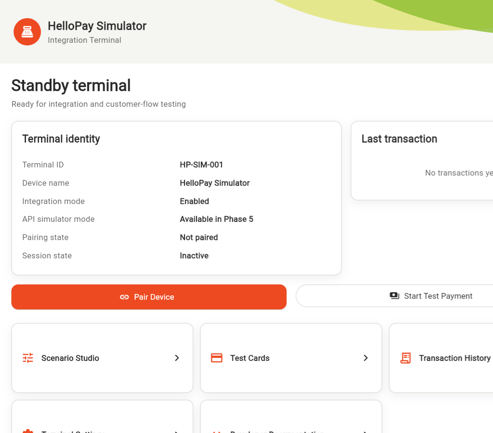
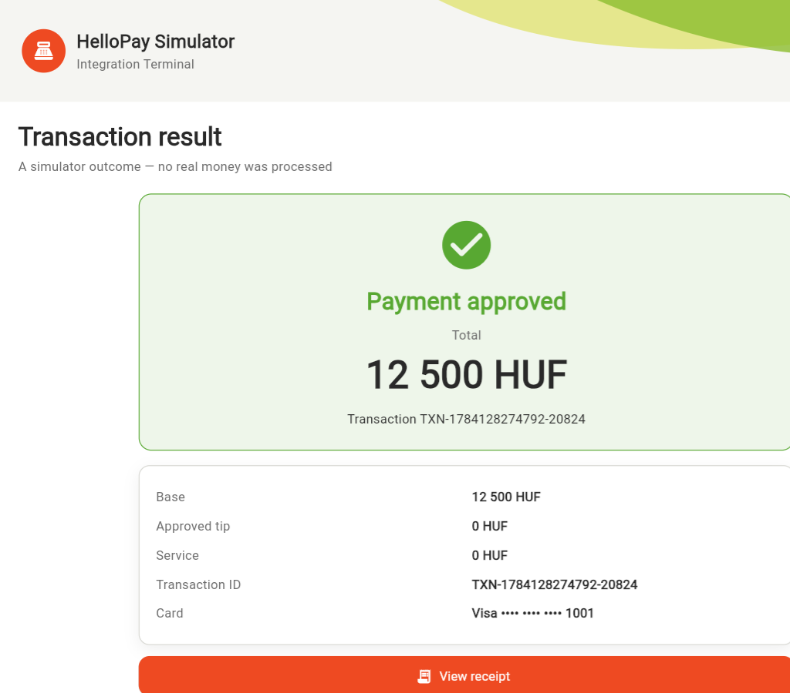

# HelloPay Simulator

<p align="center">
  
  
</p>

<p align="center">
  A Flutter payment-terminal simulator for demos, integration tests, and UI development.
</p>

<p align="center">
  <a href="https://github.com/sami97-alnaji/HelloPay_Simulator/releases/tag/v0.1.1-simulator">Download v0.1.1 APK</a>
  &nbsp;|&nbsp;
  <a href="#quick-start">Quick start</a>
  &nbsp;|&nbsp;
  <a href="#local-api">Local API</a>
  &nbsp;|&nbsp;
  <a href="LICENSE">MIT License</a>
</p>

> **Development and testing only.** HelloPay Simulator does not process real
> money, store real card details, or produce legally/fiscally valid receipts.
> It is not a production payment terminal, a production HelloPay protocol, or
> a certification tool.

## What you can test

- A responsive terminal experience for phone, tablet, desktop, and web
- One-time OTP pairing and expiring POS sessions
- Payment amounts, tips, service charges, methods, and request metadata
- Twelve fictional, masked test cards with tap, insert, swipe, PIN, and
  signature behaviours
- Approved, declined, cancelled, timeout, busy, recovery, and PIN-blocked
  paths through **Scenario Studio**
- Refunds, voids, close-batch settlement, transaction history, and receipt
  previews
- A native local HTTP API, UDP discovery, request idempotency, and a sanitized
  in-app API monitor

All payment rules are executed by the shared `SimulatorEngine`, which is also
covered by the automated test suite. The UI is therefore a view of the same
simulator behaviour that integrations exercise.

## Quick start

### Prerequisites

- Flutter SDK compatible with Dart `^3.5.3`
- An Android emulator/device, Windows desktop, or a supported Flutter target

### Run from source

```powershell
flutter pub get
flutter run -d emulator-5554
```

Other useful targets:

```powershell
flutter run -d windows
flutter run -d chrome
```

The web build provides the visual simulator. The local HTTP server and UDP
discovery require a native Android or Windows build because browsers cannot
bind local sockets.

### Install the release APK

Download [`app-release.apk`](https://github.com/sami97-alnaji/HelloPay_Simulator/releases/download/v0.1.1-simulator/app-release.apk)
from the [v0.1.1 release](https://github.com/sami97-alnaji/HelloPay_Simulator/releases/tag/v0.1.1-simulator).

Verify the downloaded file before installing it:

```powershell
Get-FileHash .\app-release.apk -Algorithm SHA256
```

Expected SHA-256:

```text
4b251223160baf76273b91390e8cc4abfdf9b7571629e690ccffa130a4312792
```

## Using the simulator

1. Launch the app and wait for the terminal to show **READY**.
2. For a UI demo, open the payment flow, enter an amount, choose a fictional
   card, and follow the on-screen tap, insert, swipe, PIN, or signature prompt.
3. Choose a preset in **Scenario Studio** to model outcomes such as a decline,
   cancellation, terminal busy state, timeout, or recovery. Use the custom
   scenario only for controlled test responses.
4. Open **Transaction History** to inspect the transaction ID, receipt preview,
   and linked refund or void operations.
5. Use the detail screen to refund the remaining amount or void the latest
   eligible sale. Choose **Close Batch** to produce a simulated settlement
   report.
6. Use **Reset Simulator** in settings when you need a clean in-memory state.

The supplied cards are deliberately fictional and masked. No valid complete
PAN or real PIN is accepted or stored. See [the test-card guide](docs/test-cards.md)
and [scenario guide](docs/scenarios.md) for the available behaviours.

## Local API

On Android or Windows, open **Terminal settings** or **Local API Monitor** and
start the server. The defaults are:

| Service | Default |
| --- | --- |
| HTTP API | `http://0.0.0.0:8443` |
| UDP discovery | Port `38383` |
| API version | `v1` |

Keep the server on a private development network. It is plain local HTTP and
must never be exposed to the public internet.

### Starting the local server

The local API does **not** start when the application launches. Start it
manually for each new app session:

1. Launch HelloPay Simulator and wait for the terminal to show **READY**.
2. Open **Terminal Settings** and enable **Local API simulator**, or open
   **Local API Monitor** and select **Start API**.
3. Confirm the running status: the monitor changes to `Listening on
   http://<address>:<port>` and **Start API** becomes **Stop API**. In Terminal
   Settings, the switch remains enabled and shows the HTTP and UDP ports.

Starting the local API simulator starts both the HTTP API and UDP discovery;
they are stopped together with **Stop API** or by disabling the settings
switch. A fully closed app stops both services, so repeat these steps after
opening the app again. The app was validated through an Android background and
resume cycle, but operating-system background behaviour is not guaranteed;
keep the simulator open while running an integration test.

The UI shows the server's bind address, which is commonly `0.0.0.0`. For a
separate POS on the same Wi-Fi network, use the Android or Windows device's
actual LAN address from its network settings, for example:

```text
http://192.168.1.50:8443/api/v1
```

Automatic server startup is not currently available.

### Pair a demo POS

First request an OTP, then create a session. Replace the placeholders with the
values returned by the prior response:

```powershell
curl.exe -X POST http://127.0.0.1:8443/api/v1/execute/otpHandshake `
  -H "Content-Type: application/json" `
  -d '{"requestId":"OTP-1"}'

curl.exe -X POST http://127.0.0.1:8443/api/v1/pair `
  -H "Content-Type: application/json" `
  -d '{"requestId":"PAIR-1","token":"<OTP>","posId":"demo-pos","posName":"Demo POS"}'
```

Use the returned `session.sessionId` in every financial request:

```powershell
curl.exe -X POST http://127.0.0.1:8443/api/v1/execute/payment `
  -H "Content-Type: application/json" `
  -d '{"requestId":"PAY-1","sessionId":"<SESSION_ID>","payload":{"base":12500,"service":0,"paymentMethod":"BANK","userCode":"demo"}}'
```

Responses use a standard envelope with `requestId`, `errorCode`,
`errorMessage`, and a UTC `timestamp`. Repeating a financial request with the
same `requestId` returns the cached response instead of creating another
transaction. The API monitor retains up to 200 redacted exchanges; tokens,
PIN-like fields, and secrets are hidden before display or copy.

For the full route contract, aliases, response examples, error handling, and
UDP discovery packet, read [the local API guide](docs/local-api.md) and
[API reference](docs/api-reference.md).

## Documentation

| Topic | Where to start |
| --- | --- |
| End-user walkthrough | [User guide](docs/user-guide.md) |
| Local HTTP and UDP integration | [Local API](docs/local-api.md) · [Integration guide](docs/integration-guide.md) |
| Architecture and developer notes | [Architecture](docs/architecture.md) · [Developer guide](docs/developer-guide.md) |
| Error behaviour | [Error codes](docs/error-codes.md) |
| Test coverage and release evidence | [Testing](docs/testing.md) · [Release checklist](docs/release-checklist.md) |
| Simulator boundaries | [Known limitations](docs/known-limitations.md) |

More than twenty runtime captures, including pairing, payment, processing,
receipts, Scenario Studio, settings, and history, are available in
[`docs/screenshots/`](docs/screenshots/).

## Validate changes

```powershell
dart format .
flutter analyze
flutter test
git diff --check
```

The v0.1.1 Android release was built, installed, and exercised on an Android
15 / API 35 emulator. The release validation included payment, pairing, refund,
void, close-batch, local HTTP, UDP discovery, responsive layouts, and recovery
flows. See the [release checklist](docs/release-checklist.md) for the recorded
scope.

## Contributing

Issues and pull requests are welcome. Keep changes simulator-only: do not add
real payment credentials, real card data, or production terminal claims. Run
the validation commands above before opening a pull request.

## License

Copyright © 2026 sami97-alnaji. Licensed under the [MIT License](LICENSE).
